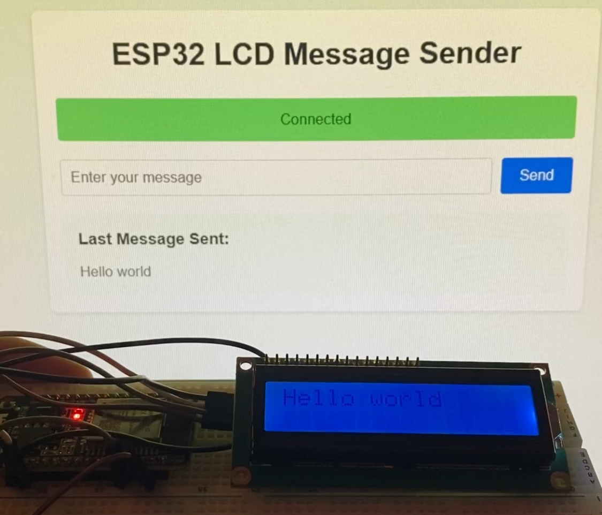

# ESP32 WebSocket Messaging System

A real-time messaging system that enables instant message transmission to an ESP32-connected LCD display over WiFi using WebSocket technology.



## Overview

This project combines hardware and software to create a dynamic messaging system where users can send messages through a web interface that instantly appear on an LCD screen connected to an ESP32 microcontroller. The system utilizes WebSocket protocol for real-time, bidirectional communication between the web application and the ESP32 device.

## Features

- **Real-time Communication**: Instant message transmission using WebSocket protocol
- **Web-based Interface**: Flask web application for sending messages
- **WiFi Connectivity**: ESP32 connects wirelessly to the network for message reception
- **LCD Display**: Messages are shown on a physical LCD screen connected to the ESP32
- **Configurable Setup**: Easy configuration for WiFi and WebSocket settings

## System Architecture

### Hardware Components
- ESP32 development board
- LCD display module
- Connection wires

### Software Components
- **Flask Backend**: Python-based web server hosting the messaging interface
- **WebSocket Server**: Handles real-time message transmission
- **ESP32 Firmware**: Arduino code managing WiFi connection and LCD display
- **Web Frontend**: Simple and intuitive user interface for sending messages

## Project Structure
```
├── Arduino/
│   └── ESP32_WebSocket_LCD/       # ESP32 firmware code
├── Flask/
│   ├── app/                       # Flask application
│   │   ├── static/               # CSS and frontend assets
│   │   ├── templates/            # HTML templates
│   │   ├── __init__.py          # App initialization
│   │   └── routes.py            # Route handlers
│   └── run.py                    # Flask application entry point
```

## Getting Started

1. Configure the ESP32:
   - Copy `config.h.template` to `config.h`
   - Set your WiFi credentials and WebSocket server details

2. Set up the Flask application:
   - Install requirements from `requirements.txt`
   - Run the Flask server using `run.py`

3. Connect to the web interface and start sending messages!
